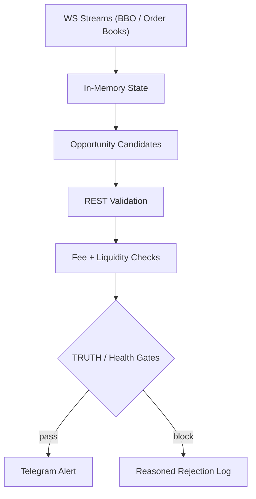

# Parsertang

[](https://github.com/Humanji7/Parsertang-public/actions/workflows/ci.yml)


Real-time async Python system for cross-exchange market monitoring, validation, and reliability-first alerting.

Domain context: CEX arbitrage monitoring.

This project focuses on a practical problem: detecting cross-exchange opportunities while aggressively filtering out false positives caused by stale books, low liquidity, bad fee assumptions, or broken streams.

## Portfolio Start Here

If you are reviewing this repo as a hiring manager / trial-project evaluator:

- `PROJECT_SUMMARY.md` (1-page portfolio summary)
- `docs/architecture.md` (system architecture and component map)
- `docs/incidents/no-alerts-root-cause.md` (real debugging case)
- `tests/test_streams_preload_markets.py` (example targeted regression test)

## What It Does

- Streams order books / BBO with WebSocket-first architecture
- Falls back to REST for markets, fees, and validation checks
- Calculates fee-aware net profit (trade fees + withdrawal/network fees)
- Applies liquidity and slippage filters before signaling
- Uses a fail-closed TRUTH gate to suppress unreliable alerts
- Sends Telegram alerts and technical diagnostics
- Logs enough operational detail to debug incidents, not just "signal/no signal"

## Engineering Highlights

This repo is a good sample of:

- `async` Python backend design (`ccxt.pro`, WS/REST coordination)
- resilience patterns (retries, reconnects, health checks, recovery logging)
- observability-first development (funnel counters, WS health, validation reasons)
- production-minded safety gates (`TRUTH`, fee validation, fail-closed behavior)
- testable bugfixes (regression tests around stream startup and exchange quirks)

## Pipeline (High Level)

1. Subscribe to exchange streams (WS-first)
2. Maintain fresh order book snapshots
3. Build candidate opportunities from overlapping symbols
4. Validate via REST + liquidity + fee calculations
5. Apply TRUTH/health gates
6. Send alert (or log exact rejection reason)



## Incident Proof (Why This Is More Than a Bot Repo)

- I investigated a "no alerts" incident and showed it was not just market conditions.
- Root cause included exchange coverage degradation (one exchange collapsed from allocated symbols to effectively zero live symbols).
- The fix path was guided by funnel/health evidence, not by loosening risk thresholds.

See: `docs/incidents/no-alerts-root-cause.md`

## Tech Stack

- Python 3.11
- Poetry
- `ccxt` / `ccxt.pro`
- `python-telegram-bot`
- Pydantic Settings

## Quick Start

```bash
poetry install
cp .env.example .env
poetry run python -m parsertang
```

Set at minimum:

- `TELEGRAM_BOT_TOKEN`
- `TELEGRAM_CHAT_ID`

If Telegram credentials are missing, alerts are logged instead of sent.

## Development Commands

```bash
poetry run python -m parsertang
poetry run pytest
poetry run ruff check .
poetry run ruff format .
```

Note: `ccxt.pro` is a commercial dependency. The public CI in this repo runs lint + smoke tests without requiring it.

## Configuration

- Main settings: `src/parsertang/config.py`
- Environment template: `.env.example`

Important runtime modes:

- `profit_mode=transfer|funded`
- `ws_native_enabled=true|false`
- `v2_validation_enabled=true|false`
- TRUTH gate settings (`TRUTH_GATE_*`)

## Portfolio Docs

This public snapshot includes short engineering notes:

- `PROJECT_SUMMARY.md`
- `docs/architecture.md`
- `docs/incidents/no-alerts-root-cause.md`
- `docs/publication-checklist.md`

## Troubleshooting (Useful Local Debug Flags)

```bash
# Full debug logging (very noisy)
LOG_LEVEL_CONSOLE=DEBUG LOG_SAMPLE_RATIO=1 poetry run python -m parsertang

# Info logs with all samples
LOG_LEVEL_CONSOLE=INFO LOG_SAMPLE_RATIO=1 poetry run python -m parsertang

# Suppress noisy categories
LOG_SUPPRESS_PREFIXES="TICK,HEARTBEAT" poetry run python -m parsertang
```

Log rotation is built in (`LOG_MAX_BYTES`, `LOG_BACKUP_COUNT`).

## Notes

- Local runs are for tests/scripts/diagnostics; production typically runs under `systemd`.
- This is a curated public snapshot of a larger working repo.
- AI tools are used heavily during development, but architectural decisions, debugging, and verification are still engineer-owned.

## Disclaimer

This software is for research/monitoring/automation experimentation. It is not financial advice.

## License

MIT (`LICENSE`)
